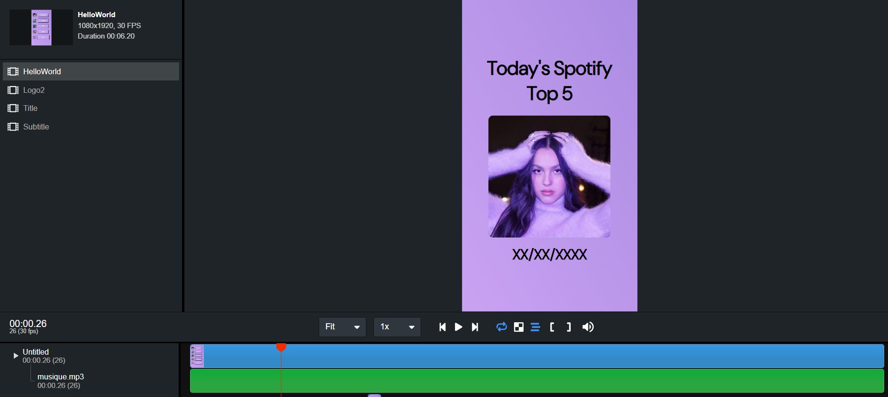

# Here is my automation of contents for Social Media using React (Remotion)

- [Link to the TikTok Account 👋](https://www.tiktok.com/@topfivespotify)

## Summary

The goal of this project is to :
- Use my knowledge in coding in the field of music
- Create content on a daily basis for social media
- Learn how to use Remotion and how to automate actions

You can find below the differents steps to achieve this project.

## Step 1 : Scraping and computing of the informations

In order to make my program work, I needed to gather theses variables : 
 - The date of the day,
 - The title of the top 5 song of the day and the URI of their cover,
 - The URI of the cover from the Top 1 Artist

We will use the API of Spotify to collect these informations.
You can find the program [main.py](https://github.com/wTrystan/remotion_Tiktok_Spotify) here.

We need to compute some variables before sending it to Remotion.

- uriHexa : We will create a palette (Library colorThief, function getPalette) using the most dominant color of the cover artist (function getColor on the URI of the artist cover)
- colorTitle : We will determine if the color of the title is black (#000000) or white (#ffffff) depending on the color of the background determined in the variable above
- titleXX : Truncate the name of the title XX if longer than 29 characters

## Step 2 : Creation of the JSON file

Once we have all the functions to gather all the informations (the function LancerJSON(idPlaylist, texteSpotify, formatDate, fichier)), they will store it into a JSON file.

ex : lancerJSON('37i9dQZEVXbLRQDuF5jeBp', "Today's Spotify Top 5", "%m-%d-%Y", 'propsUSA.json')

- The first variable tells the program to scrap data from the [Top 50 - USA](https://open.spotify.com/playlist/37i9dQZEVXbLRQDuF5jeBp) with the URI given
- The second variable is the title given for this video 
- The third variable is the format given for the date displayed in the video
- The fourth variable is the name of the output for the JSON created

Thanks to these function, I can easily modify the informations to have the same in French !

lancerJSON('37i9dQZEVXbIPWwFssbupI', "Top 5 Spotify du ", "%d/%m/%Y", 'propsFR.json')

Here is an overview of the JSON file :

<code class="language-json">{"titleText": "Today's Spotify Top 5","dateToday": "04-14-2024",
"artist_URI": "https://i.scdn.co/image/ab6761610000e5ebad85a585103dfc2f3439119a","colorTitle": "#ffffff",
"hexa_background": "#391c2c,#915d9b,#988878",
"urlTop1": "https://i.scdn.co/image/ab67616d0000b2732e8b4358d044b75807e30bf0",
"urlTop2": "https://i.scdn.co/image/ab67616d0000b273a46b07c291e6dfdee13b3ee8",
"urlTop3": "https://i.scdn.co/image/ab67616d0000b273e67611dbbf69a90d0b6cb738",
"urlTop4": "https://i.scdn.co/image/ab67616d0000b2730a31b4026a452ae8c3f97a76",
"urlTop5": "https://i.scdn.co/image/ab67616d0000b273cc04ff3e70e146ba9abacf40",
"title1": "Hozier - Too Sweet","title2": "Future - Like That","title3": "Artemas - i like the way you ...","title4": "¥$ - CARNIVAL","title5": "Benson Boone - Beautiful Thin..."}</code>

## Step 3 : Tuning of the Remotion program

We are now going to create the template to create the video with React, using Remotion.

This is the user interface, but all of the work is located in the .TSX file
Here is a snippet of code for the cover :

<code>export const MainCover: React.FC<{
	scale: number;
    source: string;
    topValue: number;
}> = ({scale, source, topValue}) => {
	const config = useVideoConfig();
	const frame = useCurrentFrame();
	const opacity = interpolate(frame, [0, 25], [0, 1]);
	return (
 
	);
};</code>

Once the template is done, we will include the values available in the JSON file to personnalise the video.

<Video src=formatUSA.mp4>

All of the differents .TSX files are available [here](https://github.com/wTrystan/remotion_Tiktok_Spotify) 

## Step 4 : Post on Social Media 

## Step 5 : Automation of the steps on local machine

## (BONUS) : Automation on AWS
